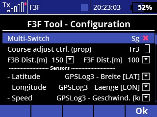

# F3F-Tool Version 2.1 / Installations- und Benutzeranleitung
### Dieses Handbuch beschreibt die Installation, Konfiguration und Verwendung des F3F-Tools für das Training der Flugaufgaben von F3F- und F3B-Wettbewerben.  
## Inhalt:
1. [Beschreibung](#Beschreibung)
2. [Installation](#Installation)
3. [Konfiguration](#Konfiguration)
4. [Benutzung](#Benutzung)
5. [Preis und Lizenz](#Preis)
6. [Änderungen (seit Version 1.4)](#changelog)  

# 1. Beschreibung
## 1.1. Allgemeine Funktion
Diese LUA-App für Jeti Sender wurde für das Training von F3F-Wettbewerben gemacht. Mittels GPS Sensor werden die Wendelinien erkannt und akustische Signale gegeben. Außerdem wird der komplette F3F-Flug unterstützt, beginnend mit dem Einflug-Countdown, dem Zählen der 10 Strecken bis zur Zeitmessung.

Es gibt darüber hinaus einen Modus für das F3B-Training, wobei im Fall der Speed-Aufgabe die Zeit für die 4 Strecken gemessen wird, für die Strecken-Aufgabe werden lediglich die geflogenen Strecken gezählt.

Voraussetzung für die Verwendung des F3F Tool ist ein GPS Sensor im Modell mit Verbindung zur Jeti Telemetrie.

## 1.2. Bekannte Einschränkungen
- Aufgrund der GPS-Toleranzen und Telemetrie-Latenzen sind die Wendesignale nicht 100% präzise, das Tool bietet aber einen guten F3F Eindruck.
- Aufgrund der geschwindigkeitsbasierten Optimierung muss der erste Ausflug aus der Strecke in der Regel weiter als 50m geflogen werden damit das System das Signal für den Einflug genau berechnen kann. Ein sehr kurzes Ausflug-/Einflugmanöver ist also nicht möglich. Abhängig von der Geschwindigkeit beim Ausflug kann das Signal bei 60 oder sogar erst bei 70 Metern gegeben werden.
- Es kann passieren dass sich durch den GPS-Drift der Startpunkt verschiebt. In diesem Fall kann sich der gesamte Kurs um mehrere Meter nach rechts oder links verschieben, da die Wendemarken vom Startpunkt aus berechnet werden. Um diesen Effekt auszugleichen, enthält die App eine Funktion um den Drift während des Fluges zu kompensieren.

## 1.3. Voraussetzungen
- Generation 2 Jeti Sender bzw. DC/DS 24 (mit Farbdisplay). 
**Diese Version kann aufgrund der Speicherbegrenzung nicht mit 'Generation 1'-Jeti Sendern betrieben werden!** Die App darf nicht auf 'DC/DS 16' oder 'DC/DS-14'-Sendern (mit Schwarz/Weiß Bildschirm) installiert werden!
- Ein GPS-Sensor der neuesten Generation muss im Modell installiert sein, die benötigten Telemetrie-Werte sind: **Breite (latitude), Länge (longitude), Geschwindigkeit, Flugrichtung**
- Wenn möglich sollten nicht benötigte Telemetrie-Werte des GPS-Sensors deaktiviert werden um die Telemetrie-Übertragung zum Sender zu optimieren. Auch die Verwendung von Telemetriewerten anderer Sensoren oder des Empfängers sollte reduziert werden.
- Die neueste verfügbare Firmware für den Jeti-Sender sollte verwendet werden. Dieses Tool wurde unter **firmware 5.06 LUA vom 26. Mai 2021** entwickelt und getestet, ältere Versionen könnten Probleme verursachen

##  1.4. F3B Support
Um dieses Tool auch für das F3B Training nutzen zu können werden einige Funktionen bereit gestellt:  
- separate Einstellung der Länge für F3F / F3B Kurse (Standard: 100m / 150m)
- abweichendes Vorgehen beim Einlesen (Scannen) der Kurspunkte für F3B entlang der A-Linie
- Zeitmessung nach 4 Strecken für die F3B Speed-Aufgabe
- Streckenzähler für die F3B-Strecken-Aufgabe, keine Zeitmessung

## 1.5. Sprachunterstützung
In der aktuellen Version sind alle Menüs und angezeigten Texte nur in Englisch verfügbar. Sprachansagen erfolgen je nach eingestellter Sender-Systemsprache in deutsch, englisch oder französisch. Werden andere von Jeti unterstützte Sprachen benötigt muss jeweils eine Audio-Konfigurationsdatei entsprechend 'audio-en.jsn' sowie ggf. weitere Audio-Dateien (.wav) erstellt werden.   

# 2. Installation
## 2.1 Dateien kopieren
- Verbinde den Sender mit dem PC über das USB Kabel
- Entpacke das zip-Archiv **'f3fTool V2.1.zip'** auf dem PC
- Kopiere den gesamten Inhalt (Datei: **'f3f_21.lc'** und Verzeichnis: **'f3fTool-21'** in das Verzeichnis 'apps' auf dem Sender
- Trenne den Sender vom PC

## 2.2. Das Tool für ein Modell aktivieren
Die folgenden Schritte müssen für jedes Modell durchgeführt werden, das mit dem F3F-Tool geflogen werden soll:
- Lade den Modellspeicher im Sender für das betreffende Modell
- Wähle: **'Menu / Zusatzfunktionen / Benutzerapplikationen'**
- Drücke die Taste unter **'+'**
- Wähle die Datei **'f3f_21'** and drücke **'ok'**  
    -> als Ergebnis erscheint:  **'1 F3F Tool    2.1    xx% Ok'**  

    
  _Abbildung: Installiertes F3F-Tool_

  ## 2.3. Konfiguration des Telemetrie Fensters
Das F3F-Tool stellt ein Telemetrie-Fenster zur Verfügung, in dem der Einflug-Countdown, die geflogenen Strecken und die Flugzeit angezeigt werden. Durch folgende Schritte wird dieses Fenster zur Anzeige hinzugefügt:
- Wähle **'Menu / Stoppuhren/Sensoren / Telemetrieanzeige'**
- Drücke die Taste unter **'+'**
- Öffne den Ordner **'LUA'** und wähle **'F3FTool'**
- die Telemetriefenster können nun durch die Pfeiltasten in die gewünschte Reihenfolge gebracht werden.   

    
  _Bild: F3F-Tool Telemetrie-Anzeige, hier zusammen mit der   
  Satellitenanzeige des GPS-Sensors_   

  
# 3. Konfiguration
## 3.1. Basiskonfiguration
Um die Basiskonfiguration zu öffnen wähle **'Menu / Zusatzfunktionen / F3F Tool - Configuration'**

   
    
   
    
  _Abbildung: Basiskonfiguration leer und ausgefüllt_

  **Bitte wie folgt konfigurieren:**
### Multi Switch
Dies ist ein Schalter für verschiedene Funktionen:
- **Einfache Betätigung:** Start der Flugaufgabe mit dem Countdown 
- **Doppelte Betätigung im F3F Modus:** Umschalten der A-base
- **Doppelte Betätigung im F3B Modus:** Umschalten zwischen den Aufgaben Speed / Strecke
- **Lange Betätigung ( >2 sek.):** Erneutes Setzen der Startposition

Es ist zweckmässig hier einen Taster zu verwenden.

### Course Adjust Control 
Der hier zugewiesene Geber wird zur Korrektur von Kurs-Verschiebungen durch GPS-Drift verwendet. Die Konfiguration ist optional. 
Wenn die Seitenrudertrimmung nicht benötigt wird kann diese hier als Geber verwendet werden, um Kursverschiebungen komfortabel zu bereinigen. 
In diesem Fall bitte wie folgt vorgehen: 
- wähle 'Menu / Feineinstellungen / Digitaltrimmung'
- setze die Seitenrudertrimmung (Tr3) auf '3-Pos. Schalter'
- gehe zurück zur 'F3F-Tool Configuration'
- weise 'Tr3' als 'Course Adjust Control' zu ( '+ / Digitaltrimmung / Tr3' )
- **Wichtig:** Der Geber muss als proportional ('Prop.') konfiguriert werden.  

    
  _Abbildung: Der Geber ist als proportional konfiguriert_   

Auf der DS 24 können auch die Trim-Geber auf der Gehäuserückseite sehr gut für diese Funktion verwendet werden. Alternativ kann der Sender auch mit einem 2-Wege-Taster erweitert werden, dieser ist bei Jeti erhältlich.

### F3B Dist.  /  F3F Dist. 
Hier kann die Länge des jeweiligen Flug-Kurses verändert werden falls erforderlich.

### Sensor-Werte: Latitude / Longitude / Speed / Flight Dir. (optional) 
Hier werden die entsprechenden Werte des GPS-Sensors zugewiesen (Breite / Länge / Geschwindigkeit / Flugrichtung). 
Steht die Flugrichtung nicht zur Verfügung - evtl. wird dies nicht vom Sensor unterstützt oder der Wert wurde deaktiviert um die Telemetrie zu optimieren - kann der Konfigurationseintrag leer bleiben. In diesem Fall berechnet das System die Flugrichtung aus den GPS-Positionen. 
Dies kann allerdings zu einer leicht verringerten Genauigkeit führen, es wird also empfohlen diesen Telemetriewert zu konfigurieren.

### Speed Announcement 
Wird dieser Punkt deaktiviert erfolgt keine Geschwindigkeitsansage nach dem Einflug in den Kurs.

### Result Logging
Wird das 'Result Logging' aktiviert werden alle geflogenen Ergebnis-Zeiten (F3F / F3B-Speed) in einer Datei im Sender abgelegt.

##  3.2. Einrichten des Flugkurses
Um einen Flugkurs zu definieren werden zwei Angaben benötigt:
- die Kurs-Ausrichtung (Windrichtung für einen F3F-Hang / Flugrichtung für einen F3B-Kurs) 
- ein Startpunkt (Kursmitte für F3F, A-base für F3B)

Zur Berechnung der Kursausrichtung werden zwei Punkte gescannt ('Left' / 'Right'): 
- beim F3F entlang oder parallel zur Hangkante
- beim F3B entlang oder parallel zur A-Linie

Die Kursausrichung wird 90° zur Linie durch diese zwei Punkte festgelegt.  
Es ist egal wo genau diese zwei Punkte genau sind (man braucht nicht bis zu den Wendelinien laufen), Hauptsache ist, dass die resultierende Linie parallel zur Hangkante / A-Linie ist. Allerdings erhöht sich die Messgenauigkeit mit dem Abstand zwischen den zwei Punkten.  

Zusätzlich muss ein Startpunkt ('Start') gescannt werden (dieser kann später verändert werden):
- beim F3F in der Mitte der Strecke nahe zur Hangkante
- beim F3B am Einflug, genau auf der A-Linie

Ist die Kursausrichtung bekannt, entweder durch einen früheren Scan oder ermittelt mit Hilfe einer Karte, kann der Wert auch direkt eingegeben werden. In diesem Fall muss vor dem Start nur noch der Startpunkt gescannt werden.  

 
  
_Abbildung: Unterschied beim Scannen von F3F- und F3B-Kurs._

###  3.2.1. Einrichten eines Hangs für F3F

Das Scannen eines Hangs für F3F erfolgt in folgenden Schritten: 
- wähle **'Menu / Zusatzfunktionen / F3F Tool – Course Setup'**
- wenn aktuell ein F3B-Kurs eingestellt ist drücke die Taste unter **'F3F'** um auf den F3F-Modus umzuschalten
- gehe mit dem Modell zu den drei beschriebenen Punkten
- an jedem Punkt drücke die entsprechende Taste **(Start / Left / Right)**
- Sind alle Punkte erfasst wird die Windrichtung des Hangs im Einstelldialog angezeigt.
- drücke **'Ok'**   

  
_Abbildung: Hang-Einstelldialog vor und nach dem Scannen der Punke.  '270°' bedeutet eine Hangausrichtung (Windrichtung) genau nach Westen._

###  3.2.2. Einrichten eines F3B-Kurses

Das Scannen eines F3B-Kurses erfolgt in folgenden Schritten: 
- wähle **'Menu / Zusatzfunktionen / F3F Tool – Course Setup'**
- wenn aktuell ein F3F-Hang eingestellt ist drücke **'F3B'** um auf den F3B-Modus umzuschalten
- gehe mit dem Modell zu den drei beschriebenen Punkten
- an jedem Punkt drücke die entsprechende Taste **(Start / Left / Right)**
- Sind alle Punkte erfasst wird die Ausrichtung des Flugkurses (Flugrichtung) im Einstelldialog angezeigt.
- drücke **'Ok'**   
 

  
_Abbildung: F3B-Kurs Einstelldialog vor und nach dem Scannen der Punke.  '270°' bedeutet, dass die Flugrichtung genau nach Westen zeigt._

###  3.2.3. Direkte Eingabe der Kursausrichtung
Wenn der Wert der Kursausrichtung (90° zur Hangkante / A-Linie) bekannt ist, kann er direkt eingegeben werden. Dies kann auch vorbereitend ohne Modell erfolgen, so dass vor dem ersten Start nur noch der Startpunkt mit aktivem GPS-Sensor erfasst werden muss, entweder erneut über den 'Course setup' Dialog oder einfach durch Halten des 'Multi Switch' für 2 sekunden (-> Funktion: _'Erneutes Setzen der Startposition'_).   

  
_Abbildung: Hangeinstellung mittels direkter Eingabe der Windrichtung (F3B-Kurs Einstellung entsprechend).  Wird kein Startpunkt gesetzt muss bestätigt werden dass die Erfassung noch nicht komplett ist_

Bis der Startpunkt definiert wurde zeigt das F3F-Tool einen Fehler an und kann nicht verwendet werden.

  
_Abbildung: Fehler: 'kein Startpunkt' (no Startpoint)_

Um den Startpunkt zu setzen bitte mit dem Modell und aktivem GPS zum Startpunkt gehen und: 
- entweder den 'Multi Switch' für 2 Sekunden halten (-> Erneutes Setzen der Startposition)
- oder erneut den 'course setup' Dialog öffnen um den Punkt zu setzen.   

 
  
_Abbildung: Setzen des Startpunkts im 'course setup' Dialog. '- no SP' zeigt den fehlenden Startpunkt an.  Um den Kurs komplett neu zu setzen drücke 'cancel' (F3B course entsprechend)_

**Wichtig:** Alle Scan-Operationen müssen mit dem eingeschalteten Modell an der zu erfassenden Stelle ausgeführt werden, außerdem muss der GPS-Sensor ausreichend Satelliten im Zugriff haben.

_Technische information: 
Die Daten des Kurses werden im Sender in der Datei 'apps/f3fTool-21/slopeData.jsn' gespeichert. Der eingestellte Kurs ist für alle im Sender gespeicherten Modelle verfügbar bis er überschrieben wird._   

# 4. Benutzung
## 4.1 Flugaufgabe starten
Eine Flugaufgabe wird gestartet durch **einfaches Betätigen** des Multi Switch  - der Flug startet mit dem 30 sek. Countdown (F3F).
Für die F3B-Speed Aufgabe beträgt der Countdown 60 sek., für F3B-Strecke gibt es keinen Countdown.

##  4.2. A-Base Umschaltung
Bei der Einrichtung eines F3F-Hangs ist die A-Base standardmässig auf der linken Seite. Durch doppelte Betätigung ('Doppelklick') des 'Multi Switch' kann die A-Base jeweils zwischen links und rechts umgeschaltet werden.
Im F3B-Modus ist die A-Base immer am eingestellten Startpunkt. 

##  4.3. Kurskorrektur zum Ausgleich von GPS-Drift
Durch GPS-Drift Effekte kann es passieren, dass sich der gesamte Kurs um einige Meter nach rechts oder links verschiebt. Wenn dies geschieht kann man durch den (optional) zugewiesenen Korrekturgeber (**'Course adjust control'**) den Kurs im Flug korrigieren, ohne extra landen und den Kurs neu scannen zu müssen. 
Jede Betätigung des Gebers nach rechts oder links verschiebt den Kurs um 1 Meter. Wird der Geber gehalten erfolgt alle 150 ms eine weitere Verschiebung. Nach dem Loslassen des Gebers wird die Strecke und Richtung der Verschiebung angesagt.  
Diese Korrekturfunktion kann beispielsweise zwischen zwei Trainingsflügen oder auch direkt während der Durchführung einer Flugaufgabe verwendet werden. 

##  4.4. Erneutes Setzen der Startposition
Wenn die Kursausrichtung korrekt eingestellt ist aber von einer anderen Startposition aus geflogen werden soll kann diese durch Halten des 'Multi Switch' für 2 sekunden (**'long click'**) neu eingestellt werden. Diese Funktion ist nützlich wenn:
- die Kursausrichtung durch direkte Eingabe eingestellt und der Startpunkt noch nicht definiert wurde
- die Position des Kurses (Mittelpunkt / A-Base) verändert werden  soll
- der Kurs sich durch GPS-Drift verschoben hat und vor dem Start neu eingestellt werden soll

##  4.5. F3B: Flugaufgabe wählen
Bei eingestelltem F3B-Kurs kann die Flugaufgabe durch zweimalige Betätigung (**double click**) des 'Multi Switch' zwischen 'Speedflug' und 'Streckenflug' umgeschaltet werden.

##  4.6. F3B Speed: zweite Wende 'nach Augenmaß'
Im F3B Speed Modus wird die 2. Wende (A-Base) vom System auch dann akzeptiert, wenn die Wendeposition vom System nicht erkannt wurde. Die Wende wird alternativ durch den Wechsel der Flugrichtung als gültig gewertet, in diesem Fall ertönt ein kürzerer doppelter Piep wenn der Richtungswechsel erkannt wurde, evtl. etwas später als normalerweise das reguläre Wendesignal.

Der Pilot muss in dieser Wende also die korrekte Wendeposition 'nach Augenmaß' sicherstellen, was aber leicht durchführbar ist, da er ja direkt an der A-Linie steht.
Andererseits wird diese Wende gerade wegen der guten Sicht des Piloten generell sehr präzise geflogen und wenn das GPS-System die Wende nicht korrekt erkennt ist der gesamte Flug ungültig. Dies soll durch diese Funktionalität verhindert werden.

## 4.7 Ansehen der gespeicherten Ergebnisse
Wurde in der Konfiguration der Menüpunkt 'Result Logging' gewählt werden alle Ergebnis-Zeiten im Sender abgelegt. Pro Tag wird eine Datei mit dem Datum als Dateiname erzeugt und pro durchgeführtem Flug eine Zeile mit Uhrzeit, Ergebnis-Zeit und Modellname abgelegt.  
Die Dateien befinden sich im Ordner **'apps/f3fTool-21/results'** und können mit dem Jeti Dateimanager (**'Menu / Zusatzfunktionen / Dateimanager'**) direkt im Sender angesehen und auch wieder gelöscht werden. Natürlich kann dies mit verbundenem Sender auch am PC erfolgen.  
**Achtung: Die erzeugten Ergebnisdateien werden vom System nicht gelöscht, dies muss also von Zeit zu Zeit manuell erfolgen!**   
  

# 5. Preis und Lizenz
Die F3F-Tool Software wird kostenlos als 'Open Source' zur Verfügung gestellt und ist unter der 'GNU General Public License V3.0' OHNE JEGLICHE GARANTIE ODER GEWÄHRLEISTUNG veröffentlicht (siehe: http://www.gnu.org/licenses/).
Das Tool kann also von jedem frei verwendet werden, ich hoffe es hilft beim Training.   
**Wenn dir das F3F-Tool gefällt und du das Projekt unterstützen möchtest freue ich mich sehr über eine Spende :)**

Link zu meinem paypal.me: 
**https://www.PayPal.Me/f3frank**   

# 6. Änderungen (seit Version 1.4) 

## 6.1 Allgemeine Änderungen
- Diese Version unterstützt keine 'Generation 1'-Hardware mit Schwarz/Weiß Bildschirm (DC/DS 14, DC/DS 16) mehr, da bei diesen Sendern der Arbeitsspeicher strikt begrenzt ist. Wenn das Tool versehentlich auf einem dieser Sender installiert wird erscheint eine Fehlermeldung in der Telemetrieanzeige. Die Installation sollte jedoch vermieden werden!
- Der Algorithmus zur Erkennung der Wendemarken wurde verbessert. Zusätzlich zur GPS-Position und Geschwindigkeit wird nun auch die Flugrichtung ausgewertet, um präzisere Ergebnisse zu erzielen, insbesondere wenn man weiter weg von der Kurslinie (F3F: Hangkante / F3B: Linie durch den Startpunkt) fliegt. 
- Kurskorrektur (Course adjust, in V1.4: Center adjust): Der Kurs kann nun durch Halten des zugewiesenen Gebers um mehrere Meter verschoben werden. Die verschobene Strecke (Meter) und die Richtung der Verschiebung werden nach Loslassen des Gebers angesagt.
- F3B Speed: Um ungültige Flüge zu vermeiden wird die 2 Wende (an der A-Linie) auch dann gezählt, wenn das GPS-System die Wendelinie nicht korrekt erkennt. Die korrekte Wendeposition muss also 'nach Augenmaß' geflogen werden.
- Die Ergebnis-Zeiten der Trainingsflüge können in einer Datei auf dem Sender gespeichert und später angesehen werden.
- kleinere Änderungen der Audio-Ausgaben

## 6.2 Änderungen der Konfiguration 
- Zusätzlich zu den Pflichtwerten 'Breite' (latitude), 'Länge' (longitude) und 'Geschwindigkeit' (speed) wird nun die Konfiguration des Telemetriewertes 'Flugrichtung' (flight direction) empfohlen. Ist der Wert nicht verfügbar kann das System ihn anhand der GPS-Positionen ermitteln, dies kann aber zu einem geringfügigen Genauigkeitsverlust führen.
- 'Center adjust control' wurde umbenannt in 'Course adjust control' 
- Die Ansage der Geschwindigkeit nach dem Einflug in den Kurs kann nun abgeschaltet werden.
- Das Logging der Ergebnis-Zeiten in einer Datei kann aktiviert werden

## 6.3 Änderungen des Kurs-Setup
- Ein F3B Kurs wird nun entlang der A-Linie gescannt, anstatt in Flugrichtung. Genau wie beim F3F Hang werden 3 Punkte (Links / Rechts / Start) eingelesen.
- Es ist nun möglich, die Kursausrichtung direkt einzugeben wenn sie bekannt ist, entweder durch einen früheren Scan oder Ermittlung anhand einer Karte. In diesem Fall muss lediglich der Startpunkt eingelesen werden.

## 6.4 Änderungen der Anzeige
- Die Entfernung zum Startpunkt wird nun auch im F3B-Modus angezeigt.
- Im F3F-Modus wird die Position des Modells (innerhalb / außerhalb des Kurses, linke / rechte Seite) angezeigt
- Die Anzeige wurde an die neue Auflösung (480 * 480 px) des neuen 'Jeti DC 24 II' Senders (und vermutlich weiterer zukünftiger Jeti Sender) angepasst, die Erkennung und Umschaltung der Auflösung erfolgt automatisch.

#
Copyright &copy; 2023, 2024 Frank Schreiber

