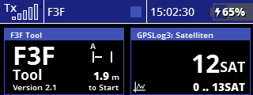
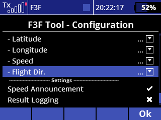
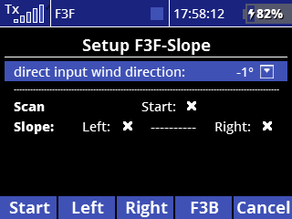
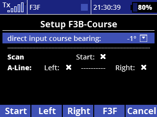
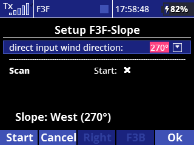
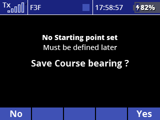
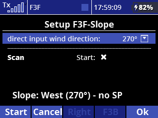

# F3F-Tool Version 2.1 / Installation guide and users manual
### This manual describes how to install, configure and use the F3F-Tool for training of F3F and F3B tasks.  
## Contents:
1. [General Description](#generalDescription)
2. [Program Installation](#programInstallation)
3. [Program Configuration](#programConfiguration)
4. [Usage](#usage)
5. [Pricing and License](#pricing)
6. [Changelog (since Version 1.4)](#changelog)  

# 1. General Description
## 1.1. What it does
This LUA-App for Jeti transmitters is made for training of slope racing competitions (F3F). Via GPS Sensor the turn lines are identified and acoustic signals are given. Also the whole run is supported, starting with the countdown, the count of the 10 legs and time measurement.

There is also a mode for F3B available, where in case of speed task the time for 4 legs is measured, in case of distance task only legs are counted.

To use this app a GPS Sensor must be placed in the model and connected to Jeti telemetry.

## 1.2. Known Limitations
- due to GPS tolerance and telemetry latency the turn signal is not 100% precise, but offers a good F3F-experience.
- due to some speed related optimization the first fly out must be more than 50m to allow the system to accurately calculate the signal for the entry. So very short fly out/entry maneuvers are not possible. Depending on the speed during fly out the signal may be given at 60 or even 70 meters.
- somtimes the GPS drift causes the starting point to shift. In this case the entire course might drift several meters to the left or right, as the turn positions are calculated in relation to start. To handle this effect the app contains a function to compensate for the drift during the flight.
## 1.3. Requirements
- Generation 2 Jeti transmitter or DC/DS 24 (with colour display). 
**This version can not be used with 'generation 1' Jeti-transmitters due to the memory limitation!** So it will not work with 'DC/DS-16' and 'DC/DS-14' transmitters (with monochrome display). Please do not install!
- Newest generation GPS-Sensor must be placed in the glider, needed telemetry values are: **latitude, longitude, speed, flight direction**
- If the sensor allows, not needed telemetry values should be disabled to speed up the telemetry transfer to transmitter. Also the usage of telemetry values from other sensors or from the receiver should be reduced.
- Please use the newest firmware for your Jeti-transmitter. This tool was developed and tested with **firmware 5.06 LUA from May 26 2021**, older Versions may cause problems.

##  1.4. F3B Support
To enable this tool also for F3B training, some features are provided:  
- seperate length definitions for F3F / F3B course (default: 100m / 150m)
- adapted course-definition for F3B along the A-line
- time measurement after 4 legs in case of a F3B-course used for speed task
- no time measurement, only leg count for distance task

## 1.5. Language support
Currently all menus and display texts are only available in english. All speech announcements are given in english, french or german,
depending on the system language of the transmitter. For other languages supported by Jeti the audio configuration file must be created similar to 'audio-en.jsn', also some needed audio-files (.wav) must be created.   

# 2. Program Installation
## 2.1 Copy Files
- Connect transmitter to PC via USB cable
- Unpack the zip-Archive **'f3fTool V2.1.zip'** on your computer
- Copy the whole contents (file: **'f3f_21.lc'** and directory: **'f3fTool-21'** into the directory 'apps' on your transmitter
- Disconnect transmitter from PC
## 2.2. Activate the tool for a model
The following steps must be done for every model you want to use with F3F-Tool:
- Select the model you want to use with the tool on your transmitter
- Select: **'Menu / Applications / User Applications'**
- Press button below **'+'**
- Select file **'f3f_21'** and press **'ok'**  
    -> result is:  **'1 F3F Tool    2.1    xx% Ok'**

    
  _Picture: Installed F3F-Tool_

## 2.3. Configure Telemetry Display
The F3F-Tool provides a telemetry window, where the countdown before entering the course, the flown legs and the flight time is shown. To add this window to your display:
- Select **'Menu / Timers/Sensors / Displayed Telemetry'**
- Press button below **'+'**
- Open folder **'LUA'** and add **'F3FTool'**
- Now you can bring the telemetry windows into the desired order by using the arrow keys.
  
    
  _Picture: F3F-Tool telemetry display, here together  
  with satellite count value from GPS_   

# 3. Program Configuration
## 3.1. Basic Configuration
To enter the basic configuration select **'Menu / Applications / F3F Tool - Configuration'**

   
    
   
    
  _Picture: Basic Configuration empty and filled_
  
**Please configure the tool as follows:**
### Multi Switch
This is a switch for different functions:
- **single click:** start the run with the countdown
- **double click in F3F mode:** toggle A-base
- **double click in F3B mode:** toggle speed / distance
- **long click:** redefine starting point

please use a springloaded switch here

### Course Adjust Control 
This control is used for compensation of GPS drift effects. The configuration is optional. 
If you don't need your rudder trim control this can be used to comfortably adjust the course. 
In this case 
- Goto 'Menu / Fine Tuning / Digital trim'
- Set the rudder trim (Tr3) to '3-pos switch'
- Go back to 'F3F-Tool Configuration'
- Assign the control ( '+ / Digital Trim / Tr3' )
- **Important:** Please configure the control as proportional (Prop.)!  

    
  _Picture: Make sure the control is configured as proportional_

On DS 24  also the trim controls on the back are useful for this function.
As an alternative the transmitter can be extended by a 2-way springloaded switch, which is available from Jeti. 

### F3B Dist.  /  F3F Dist. 
Here you can adjust the length of the course, if needed for some reason.

### Sensor values: Latitude / Longitude / Speed / Flight Dir. (optional) 
Please assign the corresponding values of your GPS sensor here.  
If the flight direction can not be provided - maybe the sensor does not support this value or it was disabled for telemetry optimization before - this value can be left empty. In this case the system determines the direction from the GPS positions.  
This can lead to a slight loss of precision, so configuring the flight direction is recommended.

### Speed Announcement 
If unchecked there will be no announcement of entry speed after course entry.

### Result Logging
If 'Result Logging' is activated, the tool will store the result times of all flights (F3F / F3B-Speed) in a file.

##  3.2. Course Setup
To define a flight course two things are needed:
- the course bearing (wind direction for F3F-slope / flight direction for F3B-course) 
- a starting point (center in F3F, A-base in F3B)

To calculate the bearing two points ('Left', 'Right') are scanned: 
- for F3F along or parallel to the slope edge
- for F3B along or parallel to the A-line

The bearing is determined 90° to the line through both points.  
It doesn't matter where those two points exactly are (no need to go to the F3F base lines) as long the resulting line is parallel to the slope / A-line. But the precision of the measurement increases with the distance of the two points.  

Additionally a starting point ('Start') must be scanned (can later be redefined or adjusted):
- for F3F in the middle of the course close to the slope edge
- for F3B at the course entry point, exactly on the A-line

If the course bearing is known - maybe from a former scan ore determined by a map - it is possible to enter the value directly. In this case only the starting point has to be scanned before the first flight.

 
  
_Picture: Difference between F3F slope and F3B course scan._

###  3.2.1. Setting up a F3F slope

To scan your slope for F3F: 
- Select **'Menu / Applications / F3F Tool – Course Setup'**
- If the current course is a F3B-course press button below **'F3F'** to toggle mode to 'F3F'
- Go with model and activated GPS (must be ready and have found its satellites !) to the described points
- On every point press the regarding key **(Start / Left / Right)**
- When all points are scanned the slope orientation is shown in the display
- Press **'Ok'**

  
_Picture: Slope setup before and after scanning the points.  '270°' means, the slope orientation (wind direction) is exactly west._

###  3.2.2. Setting up a F3B course

To setup your F3B-Course: 
- Select **'Menu / Applications / F3F Tool – Course Setup'**
- If the current course is a F3F-Slope press **'F3B'** to toggle mode to 'F3B'
- Go with model and activated GPS (must be ready and have found its satellites !) to the described points
- On every point press the regarding key **(Start / Left / Right)**
- When all points are scanned the flight direction of the course is shown in the display
- Press **'Ok'**
 

  
_Picture: F3B Course setup before and after scanning the points.  270 degrees' means, that the course (flight direction) points directly to west_

###  3.2.3. Setting a course bearing directly
The bearing value (90 deg. to the slope edge / A-line) can be entered directly if known. This can be done preparatory without the model, so that only the starting point has to be scanned with the active GPS before the first flight, either trough the 'Course setup' dialog or simply though holding the multi-switch for 2 seconds (-> function: _'redefine starting point'_).

  
_Picture: Slope setup with direct input of wind direction (F3B-Course setup works accordingly).  If no starting point is set you have to confirm that the setup is not complete yet_

Unless a starting point is defined the F3F Tool display shows an error and can not be used.

  
_Picture: Error 'no startpoint'_

Now go to the starting point with model and active GPS and 
- either 'long click' on the 'Multi Switch' (-> redefine starting point)
- or enter the course setup dialog again to define the starting point   

 
  
_Picture: Definition of starting point by 'course setup' dialog. '- no SP' indicates the missing starting point.  To redefine the complete course press 'cancel' (F3B course accordingly)_

**Important:** All scan operations must be executed with the model activated and in place, also with sufficient sattelites found by the GPS sensor!

_Technical information: 
The course data is stored in the file 'apps/f3fTool-21/slopeData.jsn' in the transmitter. Once scanned the course is available to all models stored in the transmitter until it is overwritten._   

# 4. Usage
## 4.1 Start a run
To start a run just **single click** the defined multi-Switch - the run starts with the 30 sec. countdown (F3F).
In case of a F3B-speed run the countdown will be 60 sec., for F3B-distance there is no countdown.

##  4.2. A-Base toggle
When a slope is defined, the A-Base is initially on the left side. By doing a **double click** on the defined multi-switch you can toggle the A-base between left and right.
For a F3B-course the A-Base is fix at the start position. 

##  4.3. Course adjust for drift compensation
Sometimes GPS drift effects can cause the entire course to shift several meters to the left or right. If this happens you can use the assigned **'Course adjust control'** (only if defined, this is optional) to correct the course during the flight without having to land and rescan the course.  
Each click (or movement) of the control to the left or right shifts the course by 1 meter. If the control is held a further shift occurs every 150 ms. After releasing the control the number of meters and the shift direction is announced.  
This course adjustment function can be used for example between two training runs, or even – if you like – while beeing in a run.

##  4.4. Redefinement of Start Position
If you have the course bearing scanned correctly but want to start from a different position you can redefine the start position by a **'long click'** of the defined multi-switch
what means to hold it pressed for 2 seconds. This is useful to:
- define the starting point (center / a-base) if the course bearing was defined by direct input before
- just change position of the course
- redefine the start position before launch to avoid GPS drift effects.

##  4.5. F3B: choose task
If the current course is a F3B course, **double click** on the multi-switch toggles between speed and distance task.

##  4.6. F3B Speed: second turn 'by eye'
When flying in F3B Speed mode the second turn (A-base) is accepted even if the GPS does not recognize the base line. The turn is recognized alternatively by the change of flight direction. In this case you will hear a shorter double beep when the change is detected, maybe a little later then the normal turn beep.

This function gives the pilot the responsability to keep the correct turn position, but because he is standing exactly at the base line this can easily be done by eye.  
On the other hand this turn is usually flown very precise because of the pilot's position and if the GPS system does not recognise it exactly the whole flight is invalid. This shall be avoided by this new feature.

## 4.7 Viewing the logged results
If the menu item 'Result Logging' was selected in the configuration, the result times of all flights are stored in the transmitter. A file with the date as the file name is created for each day and the current time, result time and model name is saved for each flight.  
The files are located in the folder **'apps/f3fTool-21/results'** and can be viewed and also deleted with the Jeti File Browser (**'Menu / Applications / File Browser'**) directly in the transmitter. Of course you can also connect the transmitter to PC and do it there.  
**Important: The system will not delete the created result files, this should be done manually from time to time!**   

# 5. Pricing and License
The F3F-Tool software is provided free of costs as open source. It is published under the 'GNU General Public License V3.0' WITHOUT ANY WARRANTY (see: http://www.gnu.org/licenses/). 
So feel free to use it, i hope it is helpful.  
**If you like the tool and you are willing to support the project you are welcome to make a donation, i appreciate :)**

Link to my paypal.me: 
**https://www.PayPal.Me/f3frank**   

# 6. Changelog (since Version 1.4) 

## 6.1 General changes
- This Version does not support generation 1 hardware with monochrome display (DC 14, DC 16, DS 14, DS 16) because of the memory limitations of these devices. If installed by accident an error is shown on the display but the installation should be avoided!
- The algorithm for the calculation of turn positions was improved. The current flight direction now is used additionally to the position and speed for more precise results especially if you are flying far away from the course line (F3F: slope edge, F3B: line though starting point)
- Course Adjust (formerly 'center adjust'): course can be shiftet more than one meter by holding the assigned control, the number of meters and the shift direction is announced after release of the control.
- F3B speed: to avoid invalid flights the second turn (on A-Base) is accepted even if not recognized by the GPS system. So the correct position of this turn must be ensured 'by eye'.
- Result Times of training flights can be stored in a file for later view
- Some audio changes

## 6.2 Configuration changes
- Additionally to the mandatory 'latitude' 'longitude' and 'speed' values now configuration of the 'flight direction' telemetry value is recommended. If not available the value can be calculated by the system from the GPS positions, but this can lead to a slight loss of precision.
- 'Center adjust control' was renamed to 'Course adjust control' 
- The announcement of the speed after course entry can be disabled now
- Logging of result times in a file can be activated 

## 6.3 Course Setup changes
- A F3B Course is scanned along the A-line now instead of the flight direction. Similar to F3F slope scans it is done with three points (Left / Right / Start).
- Now it is possible to enter the course bearing value directly if known, maybe from a former scan or determined by a map. In this case only the starting point must be scanned.

## 6.4 Display changes
- 'Distance to start' is now also shown in F3B mode
- In F3F mode the current model position (inside or outside course / left or right) is shown
- The display was adapted to the new resulution (480 * 480 px) of the new 'Jeti DC 24 II' transmitter (and probably further new Jeti transmitters), the resolution is switched automatically.

#
Copyright &copy; 2023, 2024 Frank Schreiber
